# CMOS_ALU
CMOS implementation of a 4-bit ALU in LTspice using 180 nm technology, featuring custom-designed logic gates, a 28T full adder, arithmetic and logic operations, and transistor-level simulation with waveform analysis.
# 1-Bit CMOS Arithmetic Logic Unit (ALU)
The Arithmetic Logic Unit (ALU) is one of the most important components of a digital processor, responsible for performing arithmetic and logical operations on binary data. In this project, a 1-bit CMOS ALU has been designed and simulated at the transistor level using 180 nm CMOS technology in LTspice.

Instead of implementing the complete ALU as a single transistor network, a hierarchical and modular design methodology has been adopted. Individual CMOS logic cells such as the AND gate, OR gate, XOR gate, Full Adder, and 4:1 Multiplexer were first designed and verified independently. These verified modules were then integrated to realize the complete ALU.

This modular approach improves readability, simplifies debugging, encourages design reuse, and allows the architecture to be easily extended to higher-bit ALUs.

# CMOS Design Considerations

The entire ALU is implemented using static CMOS logic, which consists of complementary Pull-Up Networks (PUN) formed by PMOS transistors and Pull-Down Networks (PDN) formed by NMOS transistors.

Static CMOS offers several advantages:

* Full rail-to-rail output voltage
* Negligible static power dissipation
* High noise immunity
* Reliable operation over a wide range of operating conditions
* Ease of cascading logic gates

  # Building Blocks

---

## 1. CMOS AND Gate

The CMOS AND gate is implemented using **static CMOS logic** in 180 nm technology. It produces a logic HIGH only when both input signals are HIGH. The design is realized using complementary pull-up (PMOS) and pull-down (NMOS) transistor networks, providing full voltage swing, low static power dissipation, and high noise immunity.

### Boolean Expression

\[
Y = A.B
\]

### Truth Table

| A | B | Y |
|:-:|:-:|:-:|
| 0 | 0 | 0 |
| 0 | 1 | 0 |
| 1 | 0 | 0 |
| 1 | 1 | 1 |

---

### Circuit Schematic

  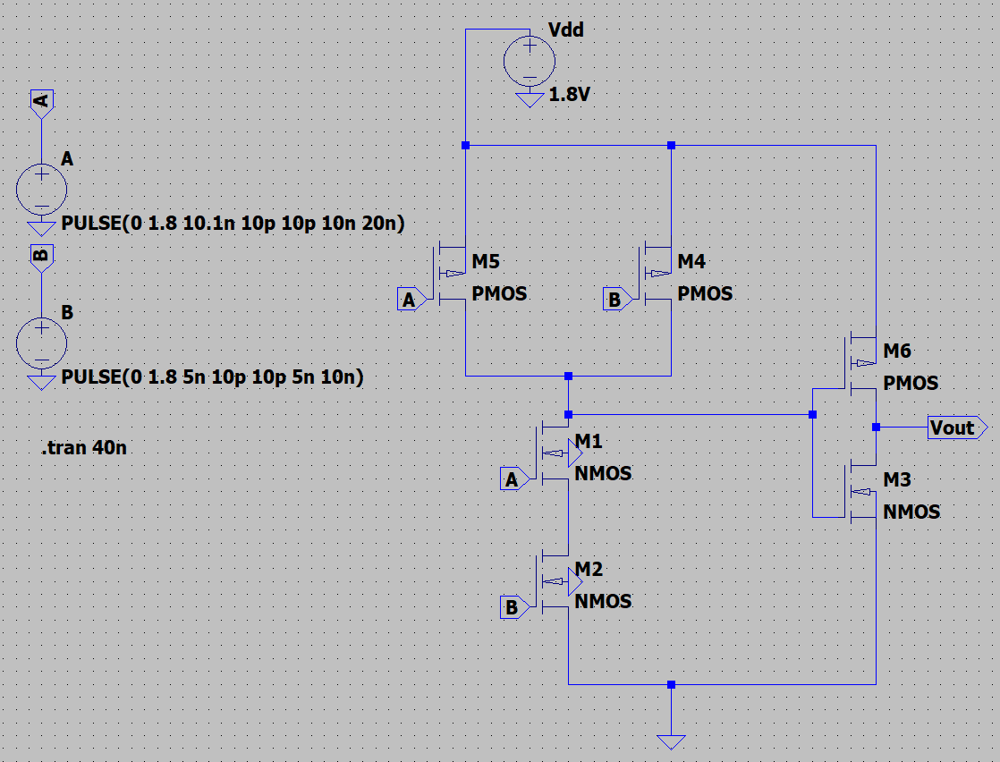

<b>Figure 1.</b> Transistor-level CMOS implementation of the AND gate.

---

### Simulation Waveform

  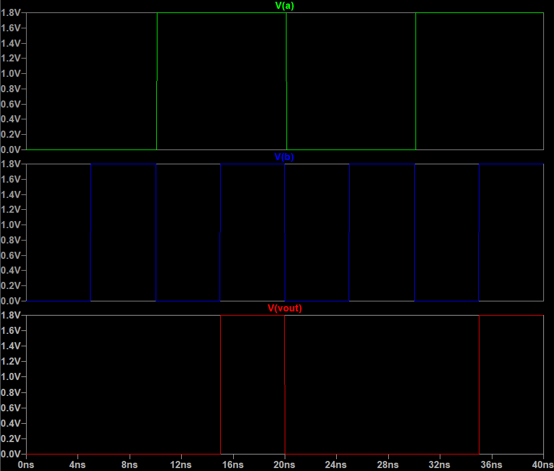

<b>Figure 2.</b> Transient response of the CMOS AND gate.

---

## 2. CMOS OR Gate

The CMOS OR gate is designed using complementary PMOS and NMOS transistor networks. It generates a logic HIGH whenever at least one input is HIGH.

### Boolean Expression

\[
Y = A + B
\]

### Truth Table

| A | B | Y |
|:-:|:-:|:-:|
|0|0|0|
|0|1|1|
|1|0|1|
|1|1|1|

### Circuit Schematic

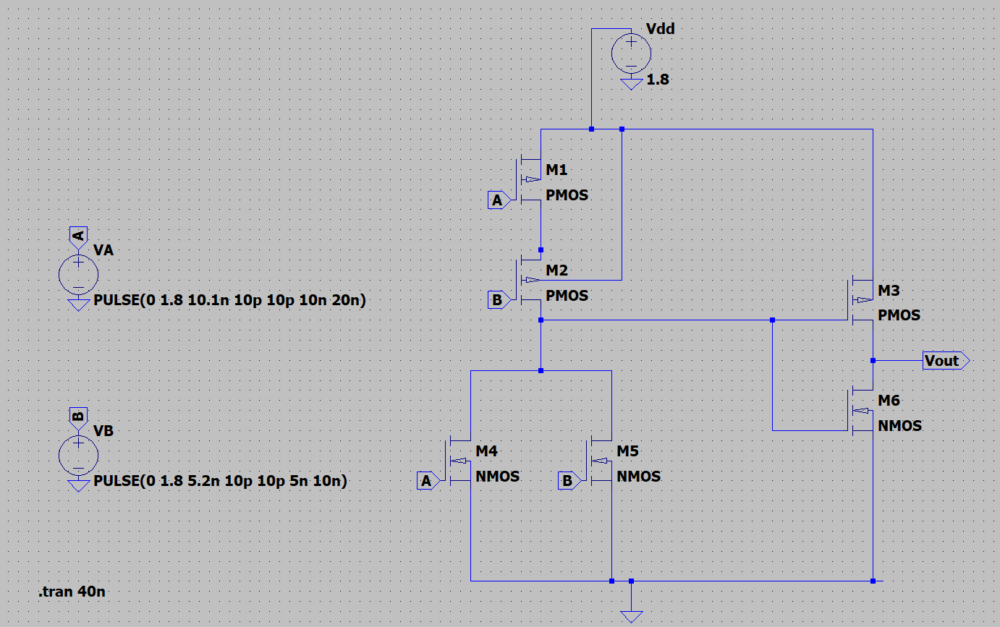

<b>Figure 3.</b> CMOS OR Gate.

### Simulation Waveform

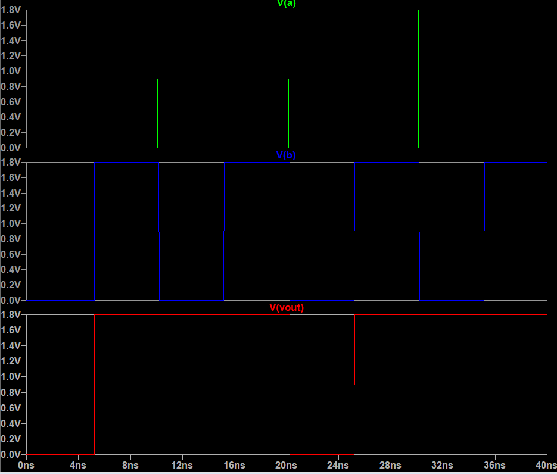

<b>Figure 4.</b> Transient response of the CMOS OR gate.

---
## 3. CMOS XOR Gate

The **Exclusive-OR (XOR) gate** is a fundamental combinational logic circuit widely used in arithmetic circuits, parity generators, error detection systems, and digital communication applications. In this project, the XOR gate forms one of the primary logical operations of the ALU and also serves as an essential component of the Full Adder.

The XOR gate produces a logic HIGH only when the two input signals are different. When both inputs are identical, the output remains LOW. The circuit is implemented using **static CMOS logic** in **180 nm technology**, providing full voltage swing, high noise immunity, and negligible static power consumption.

### Boolean Expression

$$Y = A \oplus B = \overline{A}B + A\overline{B}$$

### Truth Table

| A | B | Y |
|:-:|:-:|:-:|
| 0 | 0 | 0 |
| 0 | 1 | 1 |
| 1 | 0 | 1 |
| 1 | 1 | 0 |

---

### Circuit Schematic

  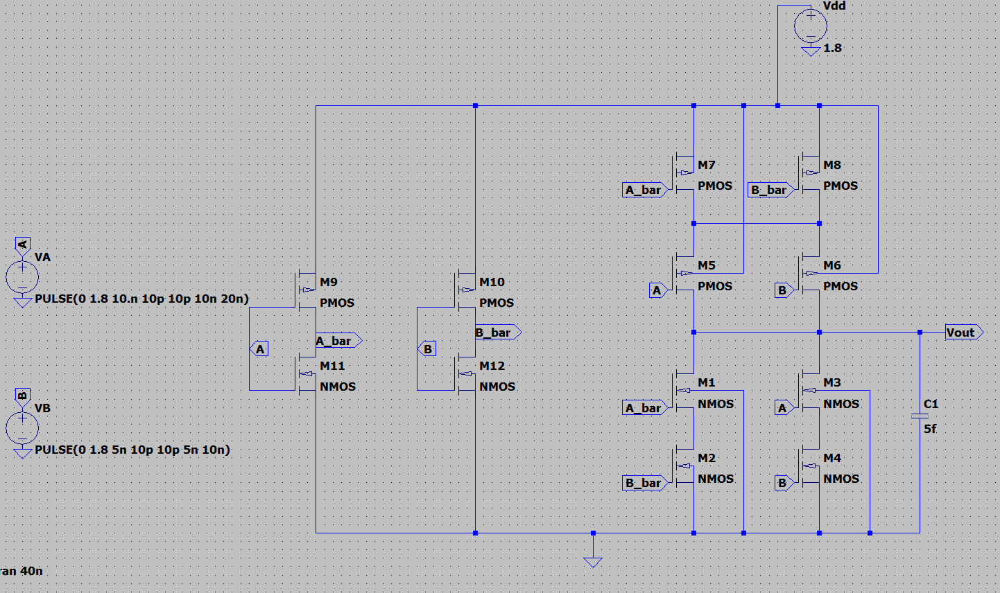

<b>Figure 5.</b> Transistor-level CMOS implementation of the XOR gate.

---

### Simulation Waveform

  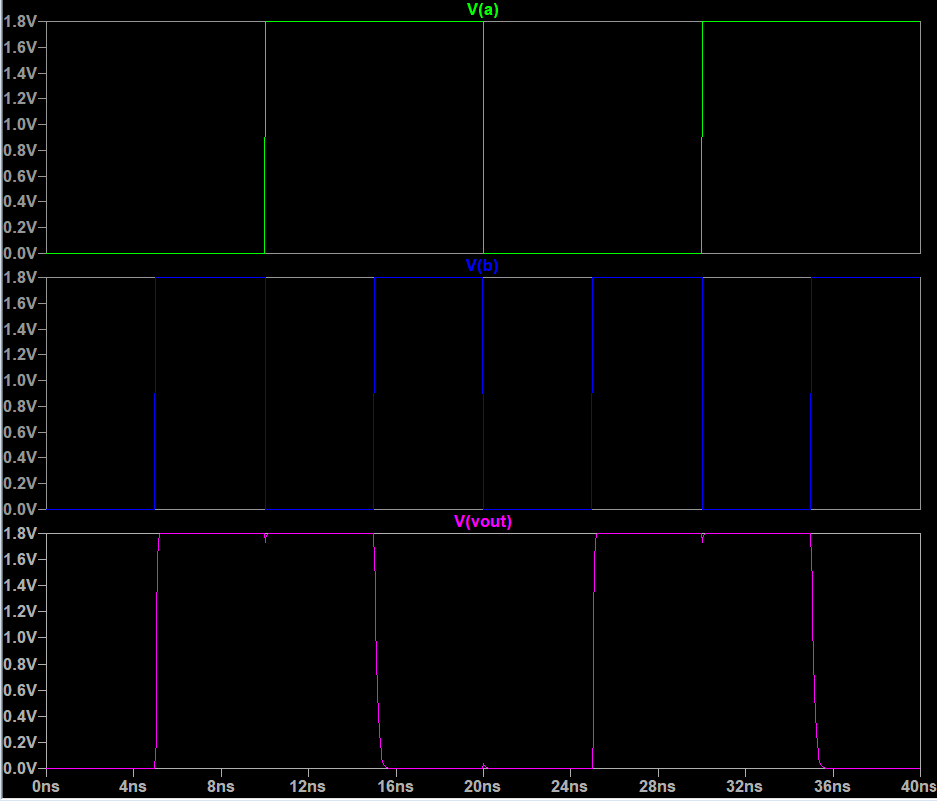

<b>Figure 6.</b> Transient simulation of the CMOS XOR gate.

---

## 4. 28-Transistor CMOS Full Adder

The Full Adder is the arithmetic core of the ALU. It performs one-bit binary addition using three inputs: **A**, **B**, and **Cin**. The implemented architecture uses 28 transistors and generates two outputs: **Sum** and **Carry Out (Cout)**.

### Equations
$$Cout = A \cdot B + Cin \cdot (A \oplus B)$$$$Sum = \overline{Cout} \cdot (A + B + Cin) + A \cdot B \cdot Cin$$

### Circuit Schematic

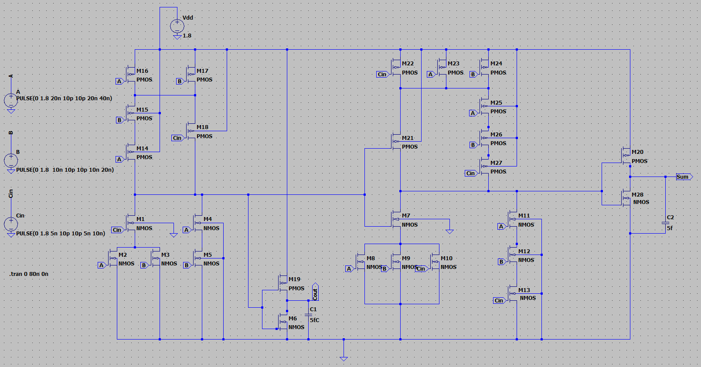

<b>Figure 7.</b> 28-Transistor CMOS Full Adder.

### Simulation Waveform

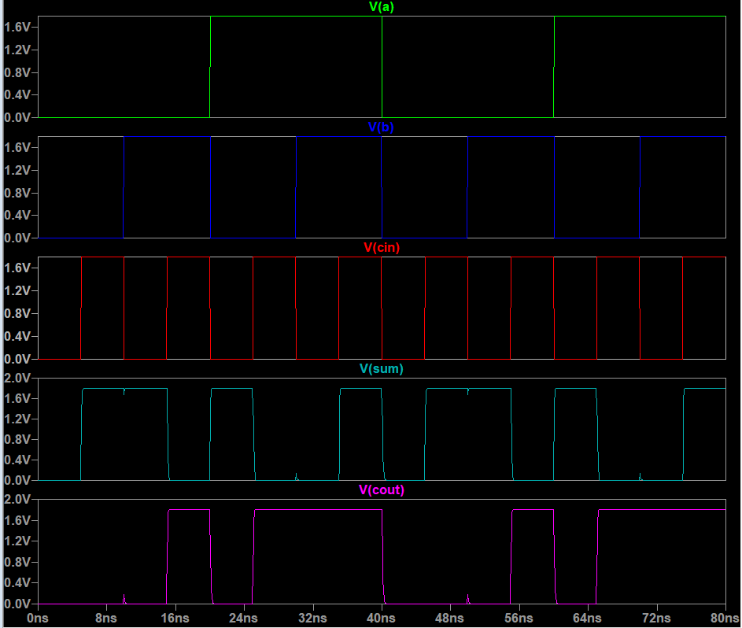

<b>Figure 8.</b> Full Adder transient simulation.

---

## 5. CMOS 4:1 Multiplexer

The **4:1 Multiplexer (MUX)** serves as the output selection stage of the ALU. It selects one of the four functional outputs (SUM, AND, OR, and XOR) based on the two select inputs (**S1** and **S0**) and forwards the selected signal to the final ALU output.

Instead of implementing the 4:1 multiplexer directly at the transistor level, a **hierarchical design methodology** has been adopted. The circuit is constructed by interconnecting **three identical CMOS 2:1 Multiplexers**, allowing the verified 2:1 MUX design to be reused. This modular approach simplifies circuit design, verification, debugging, and future scalability.

---

### CMOS 2:1 Multiplexer

The CMOS 2:1 Multiplexer is the fundamental building block used to realize the 4:1 multiplexer. It selects one of two inputs according to the select signal (**S0**).

#### Boolean Expression

\[
$$Y = \overline{S_0} \cdot A + S_0 \cdot B$$
\]

#### Truth Table

| S0 | Output |
|:--:|:------:|
| 0 | A |
| 1 | B |

#### Circuit Schematic

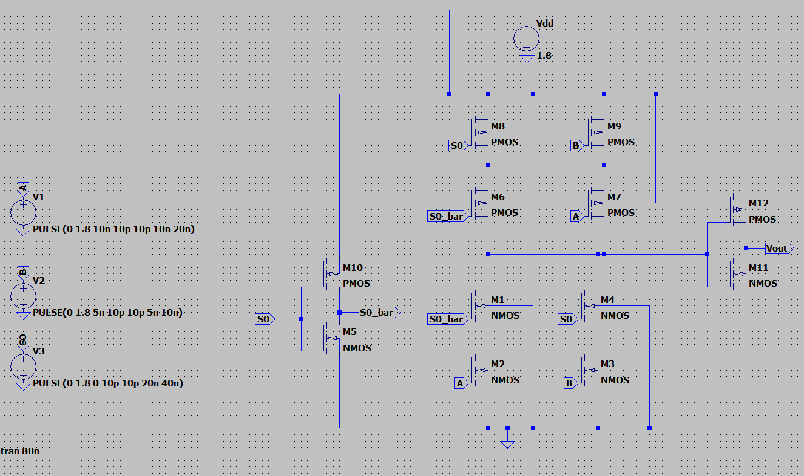

<b>Figure 9.</b> Transistor-level CMOS implementation of the 2:1 Multiplexer.

#### Simulation Waveform

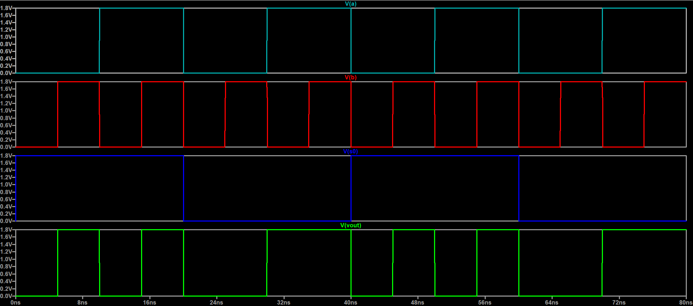

<b>Figure 10.</b> Transient simulation of the CMOS 2:1 Multiplexer.

---

### Hierarchical Construction of the 4:1 Multiplexer

The complete 4:1 multiplexer is realized using **three CMOS 2:1 Multiplexer blocks** arranged in two stages.

- **MUX1** selects between **D0** and **D1** using **S0**.
- **MUX2** selects between **D2** and **D3** using **S0**.
- **MUX3** selects between the outputs of MUX1 and MUX2 using **S1** to generate the final output.

This hierarchical implementation demonstrates the modularity and reusability of CMOS logic design.

#### Block Diagram

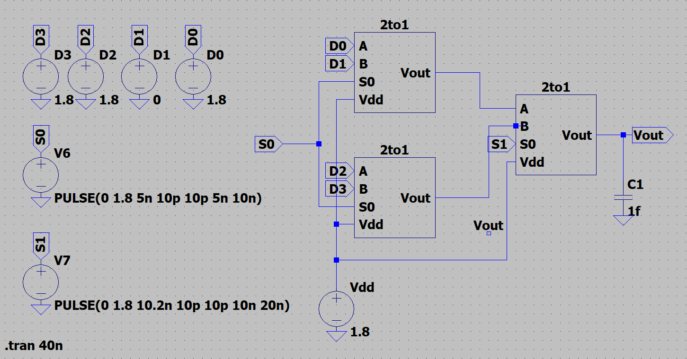

<b>Figure 11.</b> Hierarchical implementation of the 4:1 Multiplexer using three CMOS 2:1 Multiplexers.

---

---

### Selection Table

| S1 | S0 | Selected Input |
|:--:|:--:|:--------------:|
| 0 | 0 | D0 |
| 0 | 1 | D1 |
| 1 | 0 | D2 |
| 1 | 1 | D3 |

---

#### Simulation Waveform

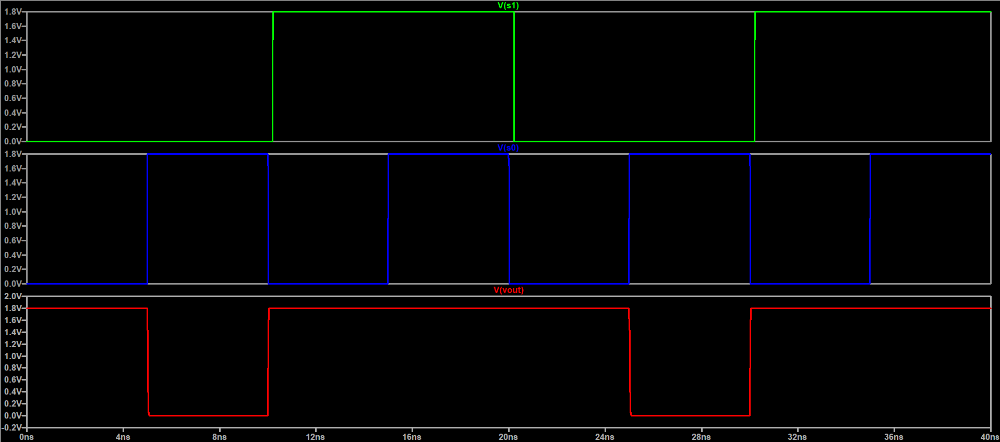

<b>Figure 13.</b> Transient simulation of the CMOS 4:1 Multiplexer.

# Simulation of 1-Bit CMOS ALU

The complete **1-Bit CMOS Arithmetic Logic Unit (ALU)** was verified using **LTspice transient analysis** under 180 nm CMOS technology. After individually validating each building block—including the AND, OR, XOR, Full Adder, and 4:1 Multiplexer—the modules were integrated to realize the complete ALU.

The simulation confirms that the ALU correctly performs both arithmetic and logical operations while maintaining full voltage swing and reliable CMOS switching characteristics.

---

## Simulation Setup

The following simulation parameters were used for functional verification:

| Parameter | Value |
|-----------|-------|
| Technology | 180 nm CMOS |
| Supply Voltage (VDD) | 1.8 V |
| Logic Style | Static CMOS |
| Carry Input (Cin) | Logic LOW (0) |
| Simulation Type | Transient Analysis |
| Simulation Time | 80 ns |

Independent pulse voltage sources were applied to the input operands (**A** and **B**) and the select lines (**S1** and **S0**) to verify every operating mode of the ALU. During the simulation, the carry input (**Cin**) was maintained at logic LOW.

---

## 1-Bit ALU Block Diagram

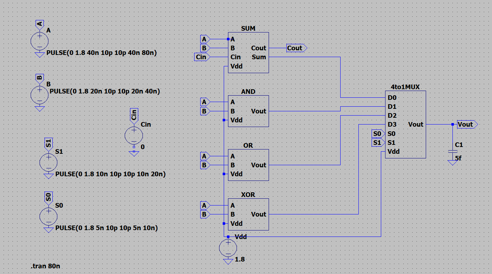

<b>Figure 14.</b> Block diagram of the proposed 1-Bit CMOS ALU.

---

## Simulation Waveform

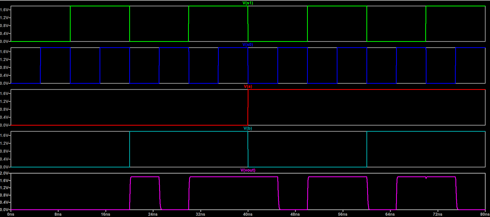

<b>Figure 15.</b> Transient simulation waveform of the 1-Bit CMOS ALU.

---

## Waveform Analysis

The transient simulation verifies the correct operation of the proposed 1-Bit CMOS ALU under various input combinations.

During the simulation:

- The input operands **A** and **B** continuously change according to the applied pulse sources.
- The select signals **S1** and **S0** cycle through all four possible combinations (**00**, **01**, **10**, and **11**), thereby selecting each ALU operation sequentially.
- For every select combination, the **4:1 CMOS Multiplexer** correctly forwards the selected functional output (SUM, AND, OR, or XOR) to the final ALU output.
- The output exhibits **full voltage swing (0 V to 1.8 V)**, confirming proper static CMOS operation.
- A small propagation delay is observed between the input transitions and the output response due to transistor switching characteristics and capacitive loading, which is expected in practical CMOS circuits.

The simulation results demonstrate that the transistor-level implementation successfully performs both arithmetic and logical operations with correct functional behavior.

---

# Extending the Design

The proposed ALU follows a **hierarchical and modular design methodology**, making it straightforward to extend the architecture to support wider data widths.

A **4-Bit CMOS ALU** can be realized by cascading four identical **1-Bit ALU** modules.

### Architecture

- Each ALU block is responsible for processing one bit of the input operands.
- The **Carry-Out (Cout)** generated by one stage is connected to the **Carry-In (Cin)** of the next stage, enabling ripple-carry addition.
- The control signals (**S1** and **S0**) are shared among all four ALU blocks, ensuring that every stage performs the same selected operation simultaneously.
- Since each block is independently verified, the hierarchical approach significantly simplifies system integration and debugging.

This modular architecture demonstrates the scalability and reusability of the designed CMOS standard cells.

---

## Functional Verification

To validate the extended architecture, random binary input vectors can be applied to the 4-Bit ALU while varying the select signals.

The observed output should correspond to the expected arithmetic or logical operation for every input combination, thereby confirming the correctness of the cascaded implementation.

---

## 4-Bit ALU Block Diagram

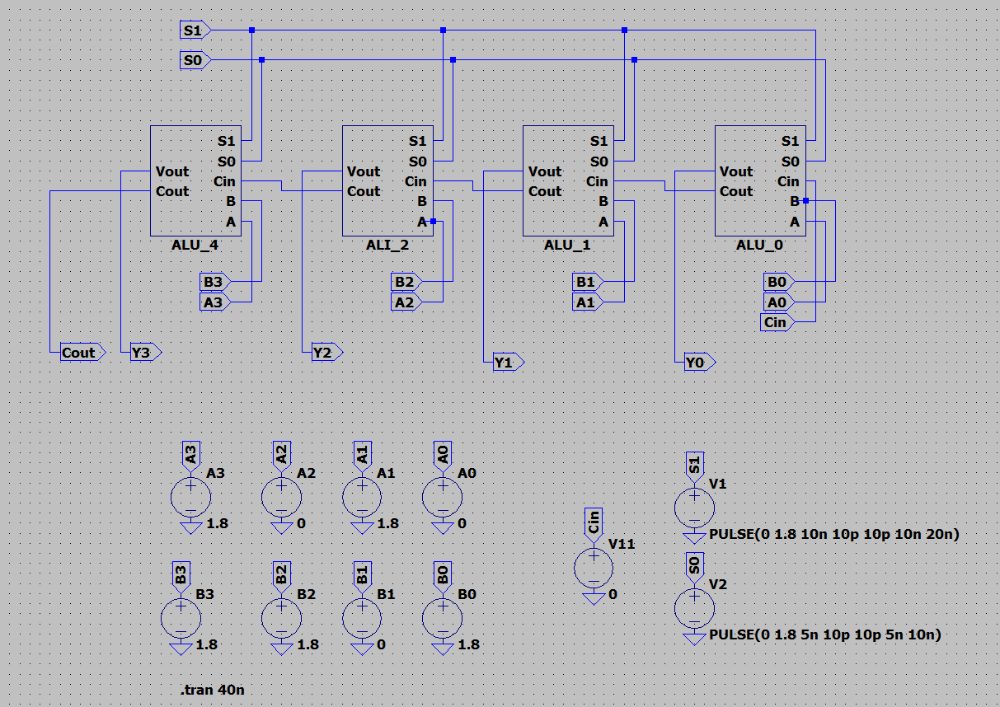

<b>Figure 14.</b> Block diagram of the proposed 1-Bit CMOS ALU.

## 4-Bit ALU Simulation Waveform

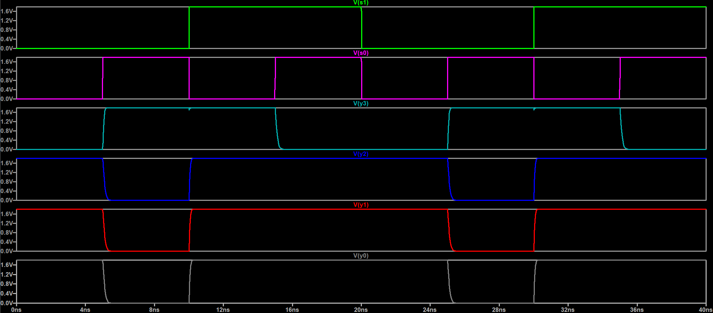

<b>Figure 16.</b> Functional verification of the 4-Bit CMOS ALU using input combinations A:1010 and B:1101 .

---

## Observation

The simulation demonstrates that the cascaded ALU correctly performs the selected arithmetic and logical operations across all four bits.

The carry propagates correctly from one stage to the next during arithmetic operations, while the logical operations are executed independently on each bit. The output waveforms closely match the expected theoretical results, confirming the correctness and scalability of the hierarchical CMOS design.

---

# Conclusion

A **transistor-level 1-Bit CMOS Arithmetic Logic Unit (ALU)** was successfully designed, implemented, and verified using **LTspice** in **180 nm CMOS technology**.

The design adopts a **hierarchical bottom-up approach**, where individual CMOS logic blocks—including the **AND gate, OR gate, XOR gate, 28-transistor Full Adder, and CMOS Multiplexers**—were first designed and independently verified before being integrated into the complete ALU.

The use of **static CMOS logic** ensures:
- Full rail-to-rail voltage swing
- Negligible static power dissipation
- High noise immunity
- Reliable switching performance
- Excellent modularity and design reusability

Transient simulation results confirm the correct execution of all arithmetic and logical operations under various input conditions. Furthermore, the modular architecture enables straightforward expansion to multi-bit ALUs, making the proposed design suitable as a fundamental building block for larger digital systems and VLSI processor architectures.

This project demonstrates a complete transistor-level CMOS implementation of a reusable ALU architecture while emphasizing hierarchical design principles commonly employed in modern VLSI circuit design.
